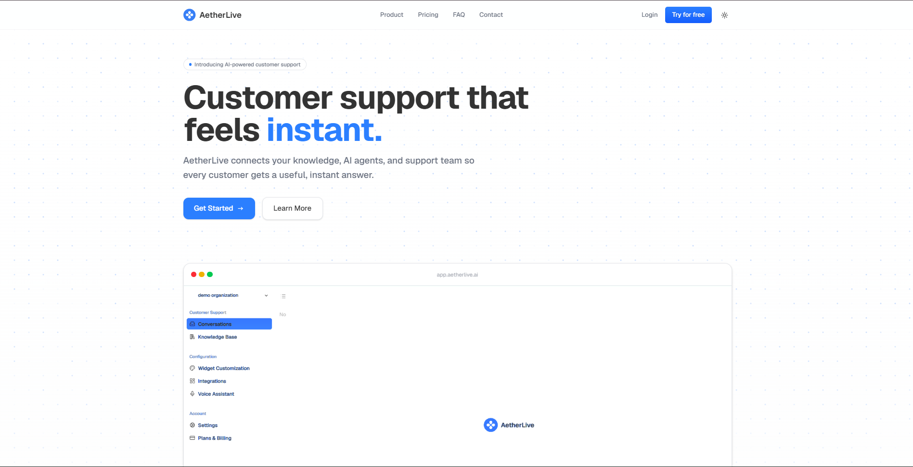

# AetherLive — AI-Powered Customer Support That Feels Instant ⚡️

<p align="center">
  
  <br/>
  <em>Customer support that feels <strong>instant</strong> — connect your knowledge, AI agents, and support team so every customer gets a useful answer, instantly.</em>
</p>

<p align="center">
  <a href="https://aetherlive.ai"></a>
  
  
  
  
  
</p>

> **AetherLive** is an AI-native customer support SaaS that helps fast-growing businesses deliver instant, accurate, 24/7 support — without scaling headcount. One embeddable widget + a unified dashboard + AI agents trained on your knowledge base = happier customers, lower costs, higher conversions.

---

## 📑 Table of Contents

- [What is AetherLive?](#-what-is-aetherlive)
- [Why Businesses Choose AetherLive — Business Benefits](#-why-businesses-choose-aetherlive--business-benefits)
- [Who Is It For?](#-who-is-it-for)
- [Key Features & Business Impact](#-key-features--business-impact)
- [Product Preview](#-product-preview)
- [How It Works](#-how-it-works)
- [Tech Stack](#-tech-stack)
- [Monorepo Structure](#-monorepo-structure)
- [Architecture Flow](#-architecture-flow)
- [Auth & Multi-Tenancy](#-auth--multi-tenancy)
- [Pricing](#-pricing)
- [Quick Start — Development Setup](#-quick-start--development-setup)
- [Environment Variables](#-environment-variables)
- [Roadmap](#-roadmap)
- [Support & Contact](#-support--contact)

---

## 🧠 What is AetherLive?

AetherLive is a **complete AI customer support platform** — not just a chatbot:

1.  **Embeddable Widget** (`apps/widget` + `apps/embed`) — drop a single `<script>` tag on any website (Shopify, WordPress, Webflow, custom stack) and go live in <10 minutes.
2.  **AI Agents** — powered by Convex Agent, RAG over your knowledge base (docs, FAQs, help-center, files), and optional **Vapi voice assistant** for phone support.
3.  **Unified Dashboard** (`apps/web`) — one inbox for chat, email, and voice. Real-time conversations, sentiment analysis, smart ticket routing, and analytics.
4.  **Backend as a Service** (`packages/backend` on Convex) — realtime DB, file storage, rate-limiting, CSRF protection, and subscription-gated features.

**Tagline from the landing page:**
> *AetherLive connects your knowledge, AI agents, and support team so every customer gets a useful, instant answer.*

---

## 💼 Why Businesses Choose AetherLive — Business Benefits

### The Problem We Solve

| Pain Point | Cost of Status Quo | How AetherLive Fixes It |
|---|---|---|
| Slow response times (hours) | 78% of customers churn after a bad support experience | **Instant AI answers** in <2s, 24/7 — even while your team sleeps |
| Support team overwhelmed | Need to hire 1 agent per ~300 conversations/month | **AI handles 70-80%** of repetitive queries (password resets, order status, FAQs) |
| Knowledge scattered | Agents waste 30% time searching docs | **Knowledge base sync** — AI searches docs/FAQs/wikis and cites the right answer |
| Tools fragmented (Zendesk + Intercom + Slack) | Context loss, double work | **Multi-channel unified inbox** + 100+ integrations |
| High churn & low CSAT | Support is a cost center | Turn support into a **revenue driver**: faster resolution → higher NPS, retention & conversion |

### Measurable ROI

- **⚡ 10x Faster First Response:** From hours → seconds. *Business benefit:* Higher conversion on pricing/demo pages — customers don't bounce waiting for help.
- **💰 60-80% Lower Support Cost Per Ticket:** Let AI resolve L1 tickets, humans focus on L2/L3. *Benefit:* Scale to 10k conversations/mo on Pro ($20/mo) vs hiring 2-3 agents ($6k-12k/mo).
- **🌙 24/7 Coverage Without Night Shifts:** AI never sleeps. *Benefit:* Capture global customers, reduce lost sales in off-hours.
- **😊 Higher CSAT & Retention:** Sentiment analysis auto-escalates frustrated customers before they churn. *Benefit:* Proactive recovery, better reviews, word-of-mouth growth.
- **📈 Revenue Impact:** Instant answers on checkout/demos → fewer abandoned carts, more qualified leads. *Benefit:* Support becomes a growth channel, not just a cost.
- **🔌 Go Live in 10 Minutes:** One script tag. No engineering sprint. *Benefit:* Founders/marketers can ship without dev resources.
- **🔒 Enterprise-Ready Security:** Clerk orgs + Convex + AWS Secrets Manager for Vapi keys, SOC2/HIPAA path, encryption. *Benefit:* Sell to larger customers with compliance needs.

### Why AetherLive vs. Alternatives?

| Capability | Traditional Helpdesk (Zendesk, Intercom) | Generic Chatbot | **AetherLive** |
|---|---|---|---|
| Setup time | Days-weeks | Hours | **Minutes** — single script |
| AI trained on YOUR docs | ❌ or expensive add-on | Generic | **✅ RAG on your KB (files + docs)** |
| Real human handoff with context | Manual | ❌ | **✅ Seamless escalation with full transcript** |
| Voice support | Separate product ($$$) | ❌ | **✅ Built-in Vapi voice assistant** |
| Pricing transparency | Per-seat + hidden AI fees | Per-message spikes | **✅ Free → Pro $20/mo → Enterprise — predictable** |
| Dev stack | Closed SaaS | Closed | **✅ Modern: Next.js + Convex realtime + Clerk multi-tenant** |

> **Bottom line:** If you want support that *feels instant* to customers and *feels effortless* to your team — AetherLive is built for you.

---

## 🎯 Who Is It For?

- **D2C & E-commerce** — reduce "Where is my order?" tickets, increase checkout conversion with instant answers.
- **SaaS & Startups** — handle onboarding, docs Q&A, and tier-1 bugs without hiring a support team at $5k/mo.
- **Agencies & Marketers** — white-label widget customization (colors, branding, position) for client sites in one dashboard.
- **Enterprises** — multi-org, SSO/SAML (Enterprise), audit logs, dedicated account manager, custom SLA.

---

## ✨ Key Features — Business Impact

| Feature | What It Does | Business Benefit |
|---|---|---|
| **Smart Ticket Routing** | AI categorizes & routes tickets to the right team/agent automatically | No manual triage → 50% less ops overhead |
| **24/7 AI Responses** | Answers common questions instantly using your knowledge base | Deflect 70%+ tickets, capture leads overnight |
| **Knowledge Base Sync** | Connect docs, FAQs, help center, uploaded files | Single source of truth → consistent, accurate answers |
| **Sentiment Analysis** | Detects frustration, auto-escalates urgently | Save at-risk customers, protect CSAT |
| **Multi-Channel Inbox** | Chat, email, social, phone in one dashboard | Unified view → faster resolution, no context switching |
| **Analytics & Reports** | Real-time response time, resolution rate, CSAT | Data-driven staffing & product decisions |
| **Widget Customization** | Colors, position, greet message, suggestions — no code | Match brand, increase widget engagement 2-3x |
| **Voice AI Agent (Vapi)** | AI phone assistant with dedicated number | Offer premium phone support without a call center |
| **File Management** | Upload/manage KB files, Convex storage | Keep AI answers fresh as product evolves |
| **Integrations** | Zendesk, Intercom, Salesforce, HubSpot, Slack + 100 more via plugins/secrets | Fit into existing stack, no rip-and-replace |

> All premium features are **subscription-gated** (`aiCustomerSupport`, `knowledgeBase`, `widgetCustomization`, `integrations`, `aiVoiceAgent`) — enforced via `requireFeature()` in Convex. See `packages/backend/AGENTS.md` for gating details.

---

## 🖼️ Product Preview

### Hero — Customer support that feels instant


*Dashboard preview: Conversations • Knowledge Base • Widget Customization • Integrations • Voice Assistant • Settings & Billing — all org-scoped via Clerk.*

### Landing Sections

- **Features grid** — Smart routing, 24/7 responses, KB sync, sentiment, multi-channel, analytics
- **Live Demo** — interactive chat simulation (try typing a message, see AI typing indicators & responses)
- **Pricing** — Starter (Free) / Pro ($20/mo, Popular) / Enterprise (Custom)
- **Testimonials** — social proof carousel ("Loved by thousands of happy customers")
- **FAQ** — Product, Setup & Integration, Security & Support

> Additional screenshots (if available):
> - `./project demo pic/Screenshot 2026-07-11 200025.png`
> - `./project demo pic/Screenshot 2026-07-11 200034.png`
> - `./project demo pic/Screenshot 2026-07-11 200050.png`

---

## ⚙️ How It Works

```
Visitor lands on your site
        ↓
Embed script (<script src="...embed.js?organizationId=xxx">) renders widget
        ↓
contactSessions.create (public Convex) →Conversations.create → messages.create
        ↓
Convex Agent (RAG) searches knowledge base + files → streams AI answer in real-time
        ↓
If unresolved → status = "escalated" → appears in dashboard Conversations inbox
        ↓
Human agent replies → customer gets instant push via Convex realtime subscription
        ↓
Optional: Vapi voice call → keys fetched securely from AWS Secrets Manager
```

- **Realtime:** Convex live queries + `jotai` in widget — no polling, no redux.
- **Organization isolation:** Every query uses `getOrganizationId(identity)` helper (`convex/lib/auth.ts`) — handles Clerk token v1 (`org_id`) and v2 (`o.id`). Always use this helper.
- **File → KB:** Uploaded files stored in Convex storage, indexed for RAG.

---

## 🧱 Tech Stack

| Layer | Technology | Why It Matters for Business |
|---|---|---|
| Frontend | **Next.js 16** (App Router) | Fast, SEO-friendly landing + dashboard |
| Backend | **Convex** (serverless DB + realtime + actions) | No backend ops, scales to millions of messages |
| Auth & Billing | **Clerk** (JWT → Convex, Organizations, Billing/PricingTable) | Multi-tenant orgs, secure auth, Stripe via Clerk — no custom billing code |
| UI | **shadcn/ui + Tailwind + Radix** (`@workspace/ui`) | Consistent, accessible design system |
| Monorepo | **Turborepo + pnpm workspaces** | One repo for web, widget, embed, backend, UI |
| Observability | **Sentry** (tunnel + Session Replay, OTLP) | Catch errors before customers do |
| Voice | **Vapi** (via AWS Secrets Manager) | Secure key rotation without redeploys |
| State | **Convex live queries + jotai** (widget) | Realtime without complexity |

---

## 📁 Monorepo Structure

```
AetherLive/
├── apps/
│   ├── web/              # Main dashboard — app.aetherlive.ai (port 3003)
│   │   ├── app/          # App Router (landing page, (dashboard), (auth))
│   │   ├── components/landing/ # hero, features, live-demo, pricing, faq, testimonials
│   │   ├── modules/      # Feature modules: auth, billing, dashboard, files, integrations, etc.
│   │   └── public/landing/ # hero-dashboard.png / hero-dashboard-light.png
│   ├── widget/           # Embeddable support widget (port 3001)
│   └── embed/            # Lightweight embed snippet (script tag)
├── packages/
│   ├── backend/          # Convex backend
│   │   └── convex/
│   │       ├── public/   # Unauthenticated/widget-facing (contactSessions, conversations, messages)
│   │       ├── private/  # Authenticated/dashboard (files, widgetSettings, plugins, vapi)
│   │       ├── lib/      # Shared helpers: auth.ts (getOrganizationId), subscription.ts, secrets.ts, rateLimits
│   │       └── schema.ts # 10 tables + indexes (see below)
│   ├── ui/               # Shared shadcn components (@workspace/ui/components/*)
│   ├── math/             # Shared utils
│   ├── typescript-config/ # base, nextjs, react-library
│   └── eslint-config/    # base, next-js, react-internal
├── scripts/              # Sentry monitors etc.
├── doc/                  # Production roadmap (AWS + Clerk Billing)
└── turbo.json
```

### Convex Schema Highlights (`packages/backend/convex/schema.ts`)

- `contactSessions` (by_organizationId) — widget visitor sessions with device metadata
- `conversations` (by_contactSessionId, by_status, by_organizationId_and_status) — unresolved/resolved/escalated
- `files`, `widgetSettings`, `plugins`, `secrets`, `rateLimits`, `csrfTokens`, `subscriptions` (plans: free/pro/enterprise)

---

## 🏗️ Architecture Flow

```
┌─────────────────┐         ┌──────────────────┐         ┌─────────────────────┐
│   Browser       │────────▶│   Next.js (Web)  │◀───────│   Convex Backend    │
│  (Customer site)│  script │  Clerk + Sentry  │  JWT   │  realtime + storage │
└─────────────────┘         └───────┬──────────┘         └─────────────────────┘
                                      │
                               ┌──────┴──────┐
                               │ Widget+Embed │  standalone, no Clerk, ConvexProvider
                               │  realtime    │
                               └─────────────┘
```

---

## 🔐 Auth & Multi-Tenancy

**Two layers:**

1.  **Clerk Middleware** (`apps/web/proxy.ts`) — protects all routes except `/sign-in`, `/sign-up`, `/api/sentry-tunnel`, `/api/health`. Redirects unauthenticated → sign-in, no-org → `/org-selection`.
2.  **AuthGuard + OrganizationGuard** (`modules/auth/ui/components/`) — client guards for Convex session + org selection.

**Critical helper:** `convex/lib/auth.ts` → `getOrganizationId(identity)` = `orgId ?? org_id ?? o?.id` (Clerk tokens never include camelCase `orgId` by default). Always use this — never read `identity.orgId` directly.

| Path | Purpose |
|---|---|
| `/sign-in`, `/sign-up` | Clerk catch-all auth routes |
| `/org-selection` | Create/pick organization post-auth |
| `/api/clerk-webhook` | Svix-verified subscription events (Convex http.ts) |

---

## 💳 Pricing

| Plan | Price | Best For | Highlights |
|---|---|---|---|
| **Starter** | Free | Exploring AI support | 1 AI agent, 100 conversations/mo, basic analytics, API |
| **Pro** | **$20/mo** · Popular | Teams automating workflows | 15 agents, 10k conversations/mo, advanced analytics, team collab, custom integrations |
| **Enterprise** | Custom | Full autonomy at scale | Unlimited agents & conversations, dedicated AM, SSO & SAML, audit logs, custom SLA |

> Billing via **Clerk Billing + PricingTable** → webhook → Convex `subscriptions` table. Feature gating via `requireFeature()` / `useSubscription()`.

---

## 🚀 Quick Start — Development Setup

```bash
# 1. Install
pnpm install

# 2. Run all apps (web on 3003, widget on 3001)
pnpm dev

# 3. Useful commands
pnpm lint          # turbo lint
pnpm typecheck     # turbo typecheck (backend is clean; web has pre-existing zod/resizable type warnings)
pnpm build
pnpm test
pnpm run setup:monitors  # create Sentry uptime monitors
```

- Frontend Convex provider lives in `apps/web/components/theme-provider.tsx` (`ConvexProviderWithClerk`) — not a separate providers file.
- `<Toaster />` (sonner) is mounted in `apps/web/app/layout.tsx` — required for toasts to show.

### Adding UI Components

```bash
pnpm dlx shadcn@latest add button -c apps/web
# components land in packages/ui/src/components/ → import as:
import { Button } from "@workspace/ui/components/button";
```

---

## 🔑 Environment Variables

```env
# Clerk (dev instance: witty-dassie — pk_test — replace with pk_live for prod)
NEXT_PUBLIC_CLERK_PUBLISHABLE_KEY=...
CLERK_SECRET_KEY=...
CLERK_JWT_ISSUER_DOMAIN=...        # also used by Convex auth.config.ts

# Convex
NEXT_PUBLIC_CONVEX_URL=...        # dev: terrific-dodo-54

# Sentry
NEXT_PUBLIC_SENTRY_DSN=...
SENTRY_AUTH_TOKEN=...             # for source-map upload + setup:monitors
SENTRY_ORG=...
SENTRY_PROJECT=...

# Vapi / AWS (prod — see doc/AetherLive-aws-clerk-production.md)
AWS_REGION=us-east-1
AWS_ACCESS_KEY_ID=...
AWS_SECRET_ACCESS_KEY=...
VAPI_SECRET_ARN=arn:aws:secretsmanager:...:secret:aetherlive/prod/vapi
# local fallback only:
VAPI_API_KEY=...
```

> Production roadmap: `doc/AetherLive-aws-clerk-production.md` — AWS Secrets Manager (JSON secret with `VAPI_PUBLIC_KEY` + `VAPI_PRIVATE_KEY`, 5-min cache), Clerk Billing prod instance, Vercel 3-project deploy (web/widget/embed), Convex prod deploy.

---

## 🗺️ Roadmap

- [ ] Remove `users.ts` demo `throw new Error("Tracking Test")` before go-live
- [ ] Clerk prod instance + Billing plans (free/pro/enterprise) + webhook hardening
- [ ] AWS Secrets JSON + IAM least-privilege + Convex prod env vars
- [ ] Vercel custom domains: `app.aetherlive.com`, `widget.aetherlive.com`, `embed.aetherlive.com`
- [ ] Rate-limit & CSRF production tuning (`public/messages.ts`)
- [x] Pipeline (`.github/workflows/pipeline.yml`): `pnpm lint` → `typecheck` → `test` → `build` → Convex + Vercel deploy (gated on `master`/`main`, secrets: `CONVEX_DEPLOY_KEY`, `VERCEL_TOKEN`) + PR previews
- [ ] Enhanced analytics dashboard, SLA alerts, and audit logs for Enterprise

---

## 📞 Support & Contact
<<<<<<< HEAD

- **Landing → Contact** section or `apps/web/components/landing/footer.tsx
=======
- **Landing → Contact** section or `apps/web/components/landing/footer.tsx`
>>>>>>> origin/master
- **Docs for AI contributors:** `AGENTS.md` + `packages/backend/AGENTS.md` (+ `convex/_generated/ai/guidelines.md` before touching Convex)

---

<p align="center">
  <strong>Built for businesses that want support to feel instant — and for customers who never want to wait.</strong><br/>
  <a href="/sign-up">Try for free →</a> &nbsp;·&nbsp; <a href="#pricing">View pricing</a> &nbsp;·&nbsp; <a href="#-how-it-works">How it works</a>
</p>
