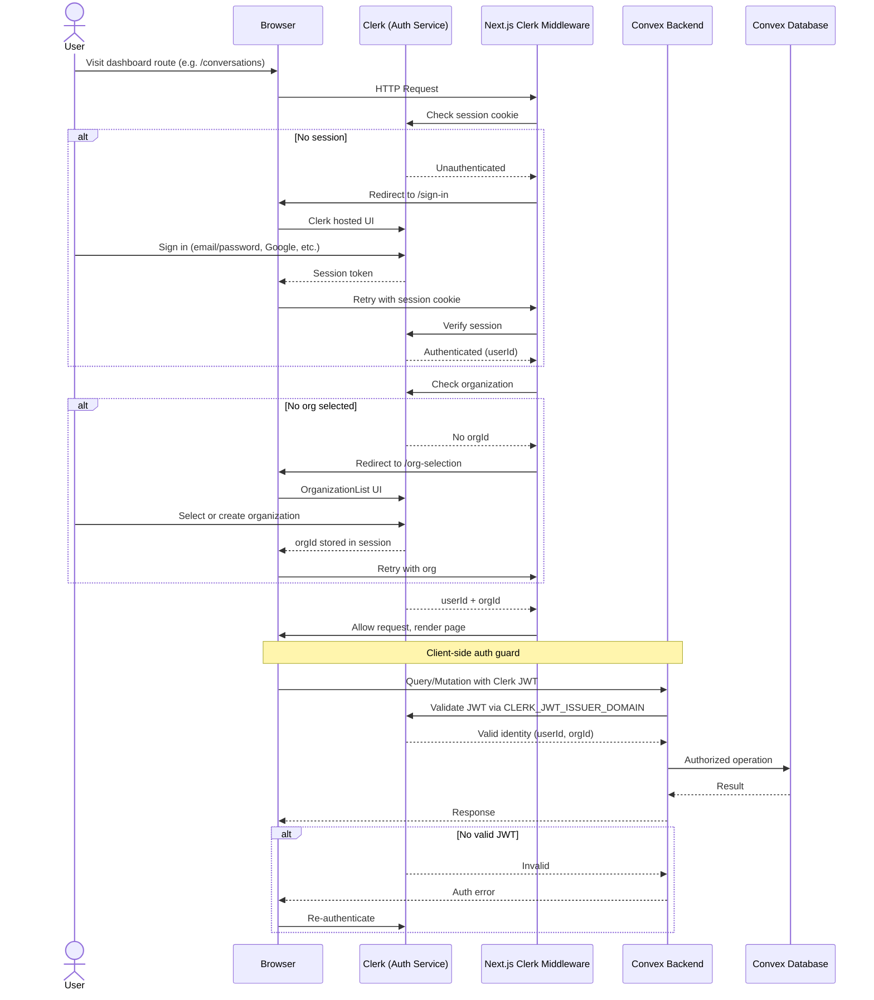

# Authentication Architecture

AetherLive uses **Clerk** for authentication, integrated with **Convex** via JWT. Auth is enforced at three layers: **middleware** (server-side route protection), **client components** (Convex `Authenticated`/`Unauthenticated` guards), and **backend functions** (Convex `getUserIdentity`).

---

## Auth Flow Diagram



---

## Architecture Overview

### Layer 1: Clerk Middleware (Server-Side)

**File:** `apps/web/proxy.ts`

The first line of defense. Runs on every eligible request (matched by the `config.matcher` regex).

```
Request -> clerkMiddleware()
  ├── isPublicRoute? -> skip protect()
  ├── auth.protect() -> redirect to /sign-in if unauthenticated
  ├── userId && !orgId && !isOrgFreeRoute? -> redirect to /org-selection
  └── all checks pass -> allow request
```

**Public routes** (no auth required):
- `/sign-in(.*)`
- `/sign-up(.*)`
- `/api/sentry-tunnel`
- `/api/health`

**Org-free routes** (authenticated but no org required):
- `/sign-in(.*)`, `/sign-up(.*)`
- `/org-selection(.*)`
- `/api/sentry-tunnel`, `/api/health`

### Layer 2: Convex Auth Config (Backend)

**File:** `packages/backend/convex/auth.config.ts`

Configures Clerk as the JWT issuer for Convex. When Convex receives a request, it validates the JWT against the Clerk domain.

```ts
domain: process.env.CLERK_JWT_ISSUER_DOMAIN
applicationID: "convex"
```

The `applicationID` must match the Clerk JWT template's "audience" claim.

### Layer 3: Clerk + Convex Provider

**File:** `apps/web/components/theme-provider.tsx`

Wires Clerk auth into Convex at the React tree root. Uses `ConvexProviderWithClerk` to automatically pass the Clerk JWT to every Convex query/mutation.

```
ThemeProvider
  ├── NextThemesProvider (light/dark mode)
  │   └── ConvexProviderWithClerk (client: convex, useAuth: useAuth)
  │       └── {children} (rest of app)
```

### Layer 4: AuthGuard (Client-Side)

**File:** `apps/web/modules/auth/ui/components/auth-guard.tsx`

Wraps the dashboard layout. Uses Convex's `Authenticated`, `Unauthenticated`, and `AuthLoading` components.

- **Loading**: Shows `AuthLayout` with "Loading..."
- **Unauthenticated**: Shows `AuthLayout` with `SignInView`
- **Authenticated**: Renders `children`

### Layer 5: OrganizationGuard (Client-Side)

**File:** `apps/web/modules/auth/ui/components/organization-guard.tsx`

Wraps inside `AuthGuard`. Uses Clerk's `useOrganization()` hook.

- **No organization**: Shows `OrgSelectionView`
- **Organization present**: Renders `children`

### Layer 6: Backend Auth (Convex Functions)

**File:** `packages/backend/convex/users.ts`

Backend functions verify auth via `ctx.auth.getUserIdentity()`.

```ts
const identity = await ctx.auth.getUserIdentity();
if (identity === null) throw new Error("Not authenticated");
const orgId = identity.orgId;
if (!orgId) throw new Error("Missing organization");
```

---

## Route Structure

```
(app)/
  (auth)/                         # Unauthenticated routes
    layout.tsx                    # Centered flex layout
    sign-in/[[...sign-in]]/page.tsx   -> <SignIn />
    sign-up/[[...sign-up]]/page.tsx   -> <SignUp />
    org-selection/[[...org-selection]]/page.tsx -> <OrgSelectionView />
  (dashboard)/                    # Protected routes
    layout.tsx                    # AuthGuard -> OrganizationGuard -> children
```

---

## Auth Views

| View | File | Renders |
|------|------|---------|
| SignInView | `modules/auth/ui/views/sign-in-view.tsx` | `<SignIn routing="hash" />` |
| SignUpView | `modules/auth/ui/views/sign-up-view.tsx` | `<SignUp routing="hash" />` |
| OrgSelectionView | `modules/auth/ui/views/org-selection-view.tsx` | `<OrganizationList hidePersonal skipInvitationScreen />` |

---

## Environment Variables

| Variable | Purpose |
|----------|---------|
| `NEXT_PUBLIC_CLERK_PUBLISHABLE_KEY` | Clerk frontend API key |
| `CLERK_SECRET_KEY` | Clerk secret key (server-side) |
| `CLERK_JWT_ISSUER_DOMAIN` | Clerk JWT issuer domain for Convex validation |
| `NEXT_PUBLIC_CLERK_SIGN_IN_URL` | Sign-in route path |
| `NEXT_PUBLIC_CLERK_SIGN_UP_URL` | Sign-up route path |
| `NEXT_PUBLIC_CLERK_SIGN_IN_FALLBACK_REDIRECT_URL` | Post-sign-in redirect |
| `NEXT_PUBLIC_CLERK_SIGN_UP_FALLBACK_REDIRECT_URL` | Post-sign-up redirect |

---

## Widget App (No Auth)

The widget app (`apps/widget`) does **not** use Clerk. It uses a plain `ConvexProvider` (without Clerk wrapper). Authentication for the widget is derived from an `organizationId` passed via query string, allowing embedded widget access without requiring the end-user to sign in.

---

## Known Issues

1. **Auth layering**: Middleware + `AuthGuard` + route-level checks can cause unexpected redirect loops if not carefully coordinated.
2. **`users.add` is non-functional**: The mutation throws `"Tracking Test"` before inserting into the database — this needs to be resolved for production use.
