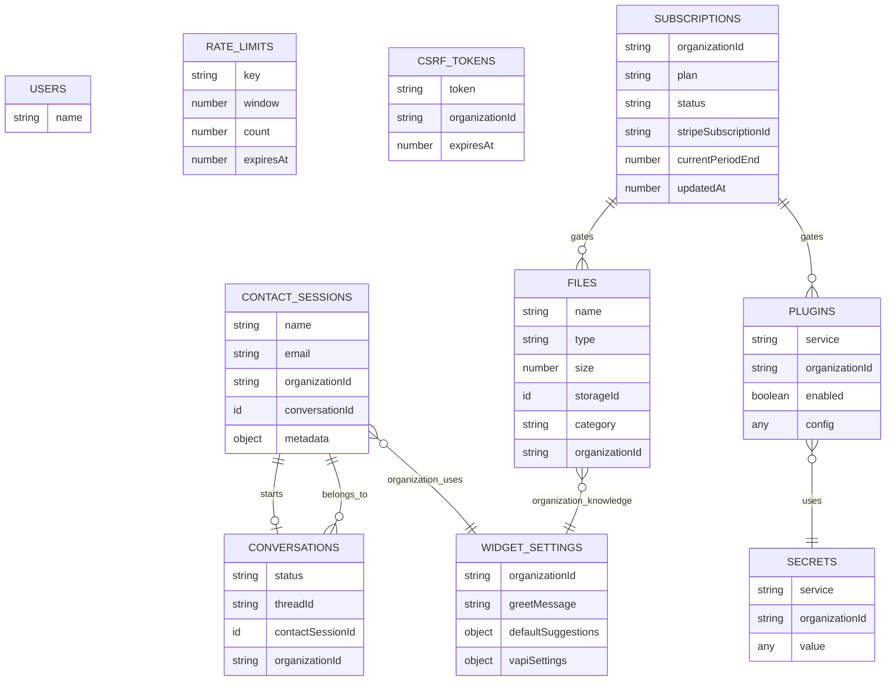
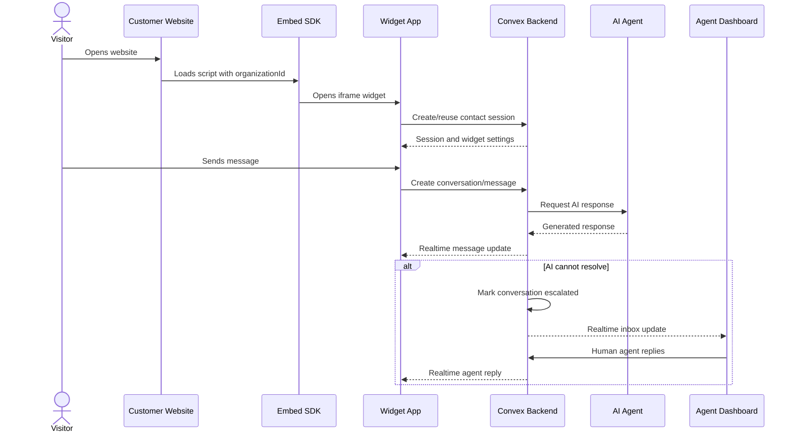
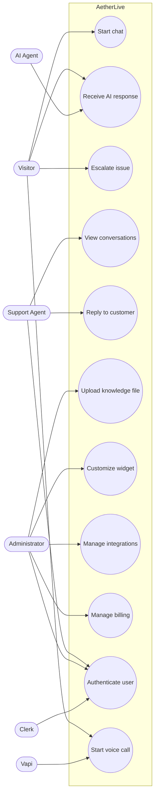
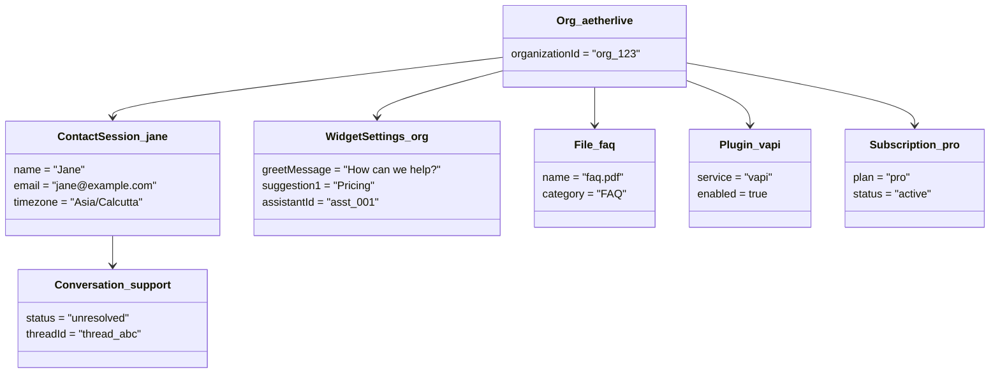
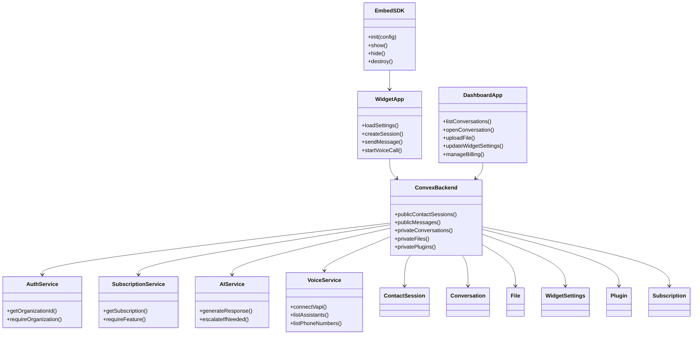
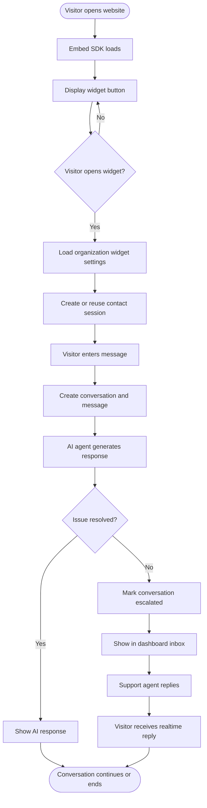
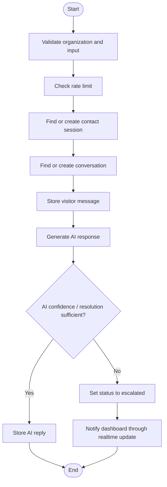
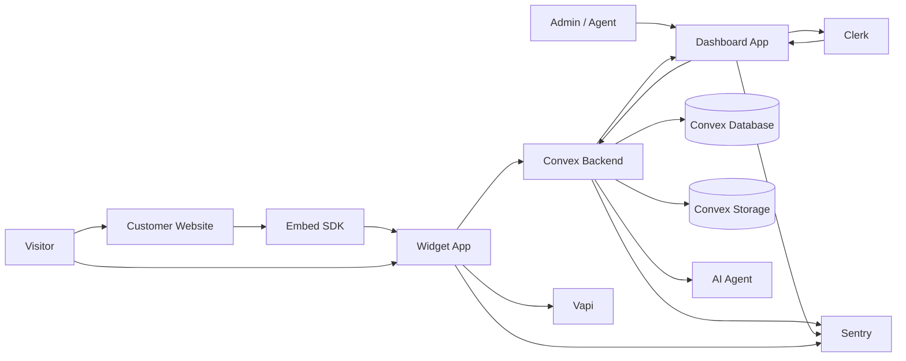

# AetherLive System Diagrams

This document contains diagram source for the required design views. The project is implemented with TypeScript/Next.js rather than C, C++, Java, or Python, so the object-oriented set is used as the primary design view. A structured design section is also included for flowchart, structure chart, and data flow coverage.

## 1. ER Diagram

## 2. Sequence Diagram

### Visitor Starts an AI Support Conversation

## 3. Use Case Diagram

## 4. Object Diagram

## 5. Class Diagram

## 6. Activity Diagram

## 7. Flowchart / Structure Chart

### Conversation Handling Flowchart

### Structure Chart

```mermaid
flowchart TD
    Root[AetherLive System]
    Web[Dashboard App]
    Widget[Widget App]
    Embed[Embed SDK]
    Backend[Convex Backend]
    Services[External Services]

    Root --> Web
    Root --> Widget
    Root --> Embed
    Root --> Backend
    Root --> Services

    Web --> Auth[Auth and Organization Guard]
    Web --> Conversations[Conversation Management]
    Web --> Files[Knowledge Base Files]
    Web --> Customization[Widget Customization]
    Web --> Billing[Billing]
    Web --> Plugins[Plugin Management]

    Widget --> Screens[Widget Screens]
    Widget --> Chat[Chat Flow]
    Widget --> Voice[Voice Flow]
    Widget --> SessionState[Session State]

    Embed --> Loader[Script Loader]
    Embed --> Iframe[Iframe Manager]
    Embed --> PublicAPI[Global Widget API]

    Backend --> PublicAPIBackend[Public Widget API]
    Backend --> PrivateAPIBackend[Private Dashboard API]
    Backend --> Storage[File Storage]
    Backend --> Realtime[Realtime Sync]
    Backend --> Security[Rate Limit and CSRF]

    Services --> Clerk[Clerk]
    Services --> OpenAI[OpenAI / Convex Agent]
    Services --> Vapi[Vapi]
    Services --> Sentry[Sentry]
```

## 8. Data Flow Diagram

